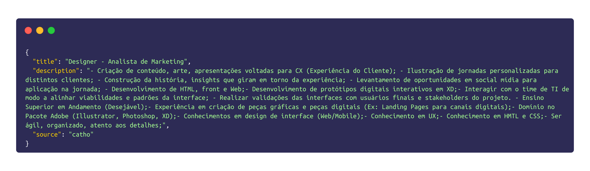
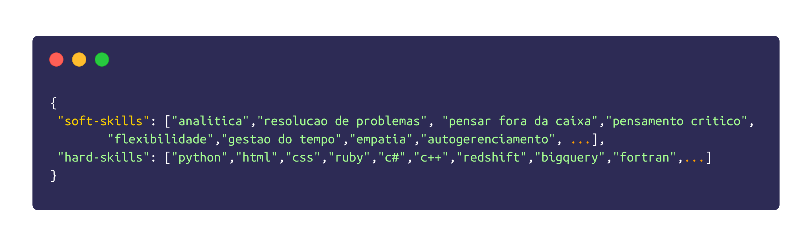

# Final project 


## Introduction

A NER model to extract skills (hard and soft) for job description fields.

## Data 

For this project, job advertisements in the technology sector were collected between two sites Remotar and Catho. For each ad, we have the title, description and where it was collected from.



In addition to job postings, two taxonomies were created, one for hard-skills and one for soft-skills.




## What's in this repository?

```
├── README.md
├── public
└── src
    ├── model
    └── scrap 
```

## Requirements